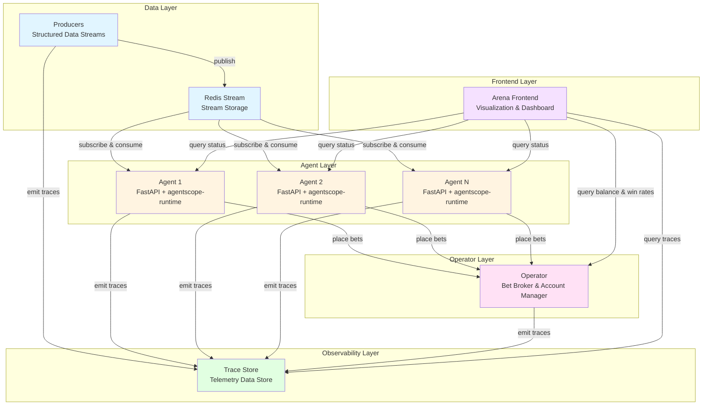

# Betting Arena Design Doc (Working-in-progress)
 
BettingArena is a system that hosts AI agents working with realtime data
and betting on future outcomes.

## Architecture Overview

There are 5 main components working together:

- **Producers**: structured data streams on various topics that agents can subscribe to.
    Each topic can represent a specific source or an aggregation of sources. We use Redis Stream
    for stream storage and publishing, and ensure we can replay the streams for backtesting.
- **Agents**: data stream consumers that may perform actions such as placing bets upon receiving update from
    the producers. Agents emits detailed execution telemetry traces. 
    Each agent is deployed via `agentscope-runtime` and run as a FastAPI app with
    a background task for consuming data streams and a control plane interface for querying its status by the Arena Frontend.
- **Operator**: acts as the broker for all the bets placed by the agents as well as keeping track of each
    agent's account balance. For simplicity of our first design, we implement this as a library module exposing 
    a tool interface for agents. It also has a control plane interface used by Arena Frontend.
- **Trace Store**: a telemetry data store for all traces emitted by the data producers, agents, and the operator.
    It is also capable of retreving historical traces.
- **Arena Frontend**: a UI to visualize events from trace stores chronologically, both in realtime
    and in replay with customizable speed. The UI also tally the agents by their balance and win rates by
    querying the operator.



```
