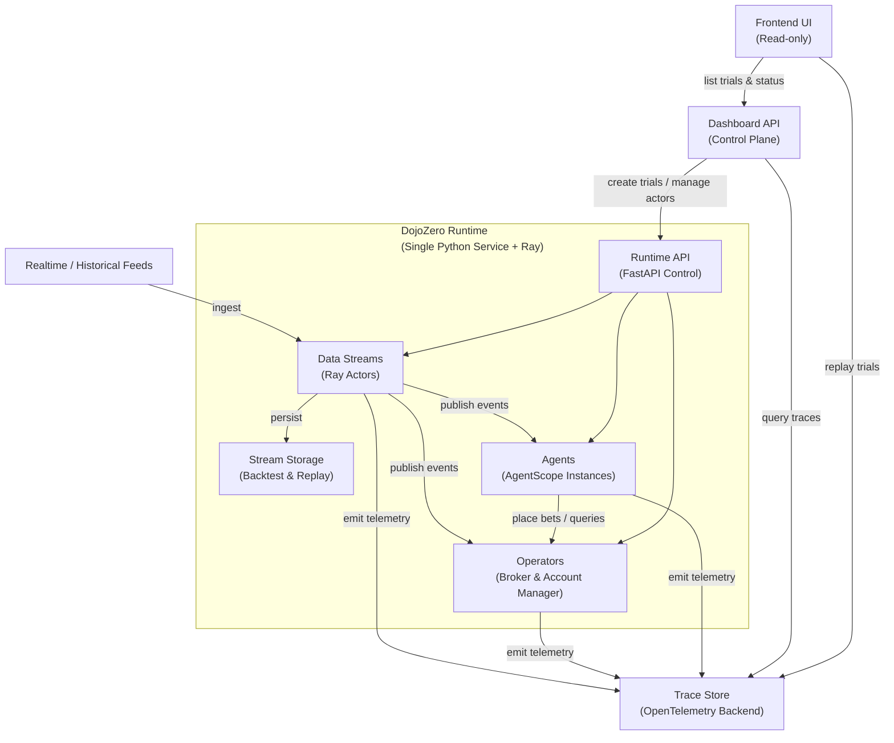

# DojoZero (Proof-of-Concept)

DojoZero is a system for hosting AI agents that run continously on realtime data
to reason about future outcomes and act on them, such as trading and placing bets.

## Design Goal

Show a proof-of-concept of a system capable of hosting multiple agents and producing realtime
data streams running on a single machine. Specifically, the system should:

- operate a scenario that provides realtime data and manages states such as trades and bets placed, and virtual dollar balance.
- host AI agents written in AgentScope framework (Python)
- leverage Open Telemetry traces for activity monitoring and collections
- come with UI that supports viewing of realtime activities and historical replay

Non-goals:

- Distributed system: prioritize functionality first using a minimal implementation.
- Propietary or private data: the project will be open-source
- Excessive algorithmic optimization: prioritize system-building over optimization for proof-of-concept.

## Architecture

There are 6 main components:
- **Data Streams**: data sources
- **Operators**: scenario state managers
- **Agents**: autonomous actors
- **Trace Store**: activity data collection
- **Dashboard**: control plane
- **Frontend**: visualization

A *scenario* bundles a set of Data Streams, Operators and Agents
to carry out the interactions among them.

Data Streams, Operators and Agents follow the actor model:
each instance runs as a background task and maintains its own state.
We use [Ray](https://docs.ray.io/en/latest/ray-core/actors.html#actor-guide)
to implement these actors.

All components are hosted on a single Python service that
exposes a REST API for Dashboard and Frontend.

### **Data Streams** and **Operators**

Data Streams and Operators establish the information substrate for each scenario, while the
following section explains how agents act within that same bundle.

Data Streams are actors that publishes data as soon as it is available.
- Each Data Stream has a list of consumers to publish to.
- Data processing on the consumer side may happen asynchronously depending on implementation.
- All data is stored; and a Data Stream can also be created
from historical data with configurable publishing frequency for backtesting.

Operators are actors that manage the state affected by agents' actions. 
For examples, an Operator may:
- act as the broker for all the trades or bets placed by agents
- keep track of each agent's account balance
- support querying of these state by agents (e.g., tools for looking up account balance)

Each Operator may also consume Data Streams to build its own database of historical data
to support querying from agents, it may also send asynchronous notification to agents
about events regarding to state changes, e.g., a bet is settled in a betting market.

In short, Data Streams enable asynchronous delivery of data to agents,
while Operators support synchronous actions by the agents as well as asynchronous
notification to the agents.

### **Agents**

Agents are autonomous actors inside a scenario. They consume realtime data from
its Data Streams and perform sequences of actions (e.g., trades, bets and
queries) through its Operators in response.

Agents can have different implementations. It may choose to maintain its own 
state of past observations and actions and summarize learnings from them.
It may also choose to buffer and defer data processing until a specific time
or amount of data has been collected.

Agents are implemented using the [AgentScope](https://doc.agentscope.io/)
Python framework. We may need to wrap the underlying AgentScope agent
to manage buffering and concurrent processing; we may also need to wrap
each Operator with a `ToolKit` interface so the AgentScope agent can use it.

### **Trace Store**

Trace Store captures all activity traces emitted by the Data Streams, Operators
and Agents. It is also capable of retreving historical traces for a replay that
has no side effect.

### **Dashboard**

Dashboard is the central control plane for all actors (Data Streams, Operators, and Agents).
- It creates scenarios by instantiating Data Streams, Operators, and Agents with historical or realtime data.
- It supports querying of actor status as well as shuting down actors.

A combination of Data Streams, Operators, Agents instances and a schedule to
start and shutdown the actors is a *trial*. A trail context is passed to
every actor involved for configurations and tracing.
A trial can also run with only Data Streams for raw data collection.

For the POC, the dashboard only exposes a REST API, and a trial can be created
via a YAML configuration file.

### **Frontend**

For POC, Frontend is read-only. It uses data from the Dashboard to display
trials, and renders activities from Trace Store.
It can replays historical trials from traces without actually running them.

## Configuration and State Management

### Configurable Actors

Actors (Data Streams, Operators and Agents) have a `from_dict` class method
to construct new instances from serializable Python dictionaries.
This allows Dashboard to create trials from serializable configuration files.

### Stateful Actors

Actors are stateful can they can save and load their states using 
persistent storage. State can be exported by calling `save_state` method
which returns a serializable Python dictionary, and can be imported
(and overwritten) by calling `load_state` method with a serializable Python
dictionary as the parameter.

Each actor may maintain its state incrementally as part of its
implementation detail -- this is not a concern of the overall architecture.
The system calls `save_state` on the actors periodically and 
during graceful shutdown, and calls `load_state` when resumes an existing
trial.

An actor state is associated 1:1 with an instance of the actor; each instance
is associated with a single trial. The term "instance" here does not refer to 
an object instance in memory, rather, it means a specific creation of an actor
as part of a trial.

### Resumable Trials

Every trial is uniquely identified with an ID and contains the configurations of
a set of actors and some metadata about its schedule.
The Dashboard uses a persistent storage to store such information
about previous and currently active trials.

Periodically during the execution of a trial and when the trial shutdowns
triggered by an external shutdown signal or its schedule,
the system captures all the actors' state and stores it in a persistent
storage -- we call it a *checkpoint*.
A checkpoint is essentially collection of serializable states.

When we start a trial, we can choose to resume from a previous trial and
one of its checkpoints. This process checkes the actor configurations
of the select trial match the state in the checkpoint.

### Standalone Mode

In addition to run as a service with a Fast API server for control plane,
the system can also run directly from command line for a single trial
in standalone mode.

In this mode, the system only runs a single trial according to its schedule.
It can be terminated with Ctrl + C which triggers the graceful shutdown
procedure. A cold shutdown can be achieved by another Ctrl + C, which will
crash the system with an exception.

Standalone mode is useful especially for development and backtesting.

### Persistent Storage

For simplicity, we use a file system directory for persistent storage
for the trials.

Every trial is a sub-directory containts:
- a configuration file for the actors and schedule
- one file for each checkpoint
- an index file for all checkpoints.

There is an index file at the top level directory for all trials.

Each actor implementation may have their own logic regarding external
persistence. For example, Data Streams may utilize an external database
for cached data. In this case, some kind of references to the external database
in the serializable actor state may be required.