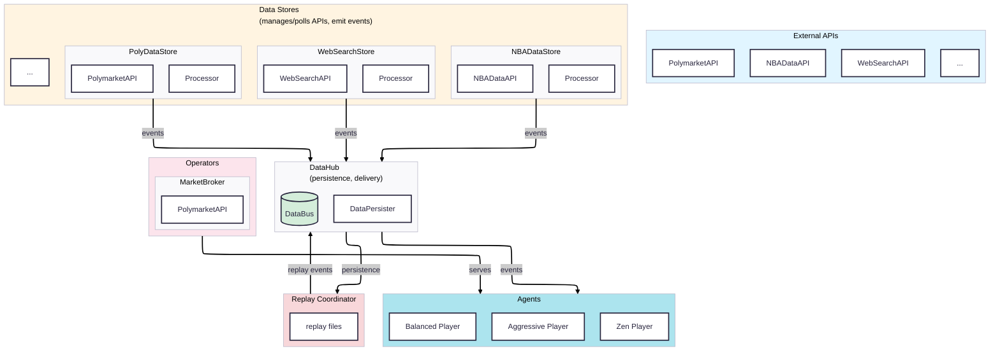

# Data Infrastructure Design

**Date**: 2025-12-10

## Design Principles

1. **Support Pull and Push Models**
   - Agents can subscribe to push streams or trigger pull queries via operators

2. **Support Replay**
   - Data streams and queries can be replayed deterministically for backtesting
   - Use file-based data stores for replay
   - Should also support multi-store inter replay

3. **Support Data Processing with LLM Integration**
   - Allows data transformation with DataJuicer and LLMs

4. **Separation of Concerns**
   - Data API management should be separated from data persistence/caching/replay logic
   - Data processor logic should be separate from stream or query infra logic and can be reused

5. **Use Proper Data Models for All Kinds of Data Inputs**
   - Richer info makes agent building easier and context richer
   - Easier to strip away all the metadata if not needed later

6. **Support Data Aggregation**
   - Specifically for more generic scenarios; like NBA play by play aggregates to in-game stats
   - The aggregators have to support both stateless and stateful to deal with different situations

## Architecture Overview

### Core Principles

1. **Event-Driven Architecture**: All data flows as events through centralized DataHub
2. **Replay Support**: Events persisted to file, replayed deterministically for backtesting
3. **LLM Integration**: Data transformation using LLMs or DataJuicer in processors
4. **Separation of Concerns**: 
   - ExternalAPI: API management
   - DataStore: Polling APIs, event transformation, emitting to DataHub
   - DataHub: Persistence, merging, delivery to agents
   - Processors: Event transformation logic (raw → cooked)
5. **Schema-Based Data Models**: Rich, typed schemas for all data inputs
6. **Stream Processing**: Raw events → processors → cooked events → DataHub

## Architecture Diagram



## Core Components

### DataEvent

**Push-based change events** representing incremental updates/deltas.

- Stream changes as they occur via DataEventStreamers
- Always incremental (deltas/changes), optimized for streaming
- Examples: `PlayByPlayEvent`, `OddsChangeEvent`, `InjuryEvent`, `GameStatusEvent`

```python
@dataclass
class DataEvent:
    event_type: str
    timestamp: datetime
    game_id: str | None
    metadata: dict[str, Any]
```

#### Event Registration

Event classes are registered using the `@register_event` decorator to enable automatic deserialization during replay:

```python
from agentx.data._models import DataEvent, register_event

@register_event
@dataclass(slots=True, frozen=True)
class RawWebSearchEvent(DataEvent):
    query: str
    results: list[dict[str, Any]]
    intent: str | None = None
    
    @property
    def event_type(self) -> str:
        return "raw_web_search"
```


### DataFact

**Pull-based snapshots** representing current state at a point in time.

- Query current state on-demand (live mode only, not supported in backtest)
- Always snapshots (current state), optimized for fast queries
- Examples: `GameScoreFact`, `OddsFact`, `GameStatusFact`, `PlayerStatsFact`

```python
@dataclass
class DataFact:
    fact_type: str
    timestamp: datetime
    game_id: str | None
    metadata: dict[str, Any]
```

**Note**: Facts are not persisted or used in backtest mode. Only events flow through the system for replay.

### ExternalAPI

**Abstraction layer** for managing external service API connections. Used by both **DataStores** (data retrieval) and **Operators** (actions like placing bets).

- API configuration, request/response management, error handling
- Implementations: `NBAExternalAPI`, `WebSearchAPI`, `PolymarketAPI`

```python
class ExternalAPI(ABC):
    async def fetch(endpoint: str, params: dict | None = None) -> dict[str, Any]
    async def place_bet(market_id: str, outcome: str, amount: float) -> dict[str, Any]
```

### DataStore

**Manages external APIs, polls for data, transforms events, and emits to DataHub.**

- Polls external APIs at configured intervals
- Transforms raw API data to `DataEvent` objects
- Maintains **Stream Registry**: raw event types → processors → cooked event streams
- Emits both raw and cooked events to DataHub
- No persistence (handled by DataHub)
- Optional fact queries for live mode (not used in backtest)

**Implementations**: `NBAStore`, `PolymarketStore`, `WebSearchStore`

```python
class DataStore(ABC):
    # Stream registry: raw event types → processors → cooked streams
    def register_stream(stream_id: str, processor: DataProcessor | None, source_event_types: list[str]) -> None
    def list_registered_streams() -> list[str]
    
    # Event emission
    async def emit_event(event: DataEvent) -> None
    def set_event_emitter(emitter: Callable[[DataEvent], None]) -> None
    
    # Polling
    async def start_polling() -> None
    async def stop_polling() -> None
```

**Registry Creation**: Store subclasses register streams in `__init__` method.

```python
class NBAStore(DataStore):
    def __init__(self, store_id: str = "nba_store", ...):
        super().__init__(store_id, api=NBAExternalAPI())
        
        # Register stream: raw_play_by_play → processor → play_by_play
        self.register_stream(
            "play_by_play",
            PlayByPlayProcessor(),
            ["raw_play_by_play"],
        )
```

### DataHub

**Central event bus for persistence, merging, and delivery to agents.**

- Receives events from all DataStores
- Persists events to file (timestamped, typed, JSONL format)
- Manages agent subscriptions (event types, stream IDs)
- Dispatches events to subscribed agents
- Supports replay mode (reads from file, replays events)

```python
class DataHub:
    # Agent subscriptions
    def subscribe_agent(agent_id: str, stream_ids: list[str] | None, event_types: list[str] | None, callback: Callable) -> None
    def unsubscribe_agent(agent_id: str) -> None
    
    # Event reception
    async def receive_event(event: DataEvent) -> None
    
    # Store connection
    def connect_store(store: DataStore) -> None
    
    # Replay
    async def start_replay(replay_file: Path) -> None
    async def replay_all() -> None
    async def replay_next() -> DataEvent | None
```

**Key Responsibilities**:
- **Persistence**: All events written to file for replay
- **Merging**: Events from multiple stores merged chronologically
- **Delivery**: Events dispatched to subscribed agents based on event types/stream IDs

### Processor

**Transforms raw events to cooked events** (or facts for live queries).

**Types**:
- **Event Transformers**: Raw events → cooked events (for streams)
- **Fact Generators**: Events → facts (for live queries only, not persisted)

```python
class DataProcessor(ABC):
    async def process(events: Sequence[DataEvent]) -> DataEvent | DataFact | None

# Example: Transform raw to cooked
class PlayByPlayProcessor(DataProcessor):
    async def process(self, events: Sequence[DataEvent]) -> DataEvent | None:
        raw_event = events[0]  # RawPlayByPlayEvent
        return PlayByPlayEvent(
            timestamp=raw_event.timestamp,
            game_id=raw_event.game_id,
            # ... transform fields
        )

# Usage: Register in store
store.register_stream("play_by_play", PlayByPlayProcessor(), ["raw_play_by_play"])
```

**Implementations**:
- `PlayByPlayProcessor`: `RawPlayByPlayEvent` → `PlayByPlayEvent`
- `WebSearchProcessor`: `RawWebSearchEvent` → `WebSearchEvent`
- `OddsChangeProcessor`: `RawOddsChangeEvent` → `OddsChangeEvent`

**Note**: All event classes returned by processors must be decorated with `@register_event` to support proper deserialization during replay.

### ReplayCoordinator

**Orchestrates replay from files through DataHub** for backtesting.

- Reads events from persistence file (created by DataHub)
- Replays events through DataHub to agents
- Maintains chronological ordering
- No queries or additional data - only persisted events

```python
class ReplayCoordinator:
    def __init__(self, data_hub: DataHub, replay_file: Path | str | None = None)
    async def start_replay(replay_file: Path | str | None = None) -> None
    async def replay_all() -> None
    async def replay_next() -> DataEvent | None
    def stop_replay() -> None

# Usage
coordinator = ReplayCoordinator(data_hub=hub, replay_file="data/events.jsonl")
await coordinator.start_replay()
await coordinator.replay_all()  # Replay all events to agents
```

**Key Points**:
- Events are read from the same file format that DataHub writes
- Events are replayed through DataHub (same delivery path as live mode)
- No queries, no additional data - pure event replay
- Agents receive events as if they were live
- **Event deserialization**: Uses `DataEventFactory.from_dict()` which relies on the `@register_event` decorator to automatically reconstruct the correct event subclass from persisted JSON data

### Agents & Operators

**Operators**:
- Pull DataFacts from DataStores (synchronous queries)
- Use ExternalAPIs directly for actions (placing bets, executing trades)
- Examples: `GoogleSERPRetriever`, `PolyMarketInfoRetriever`

**Agents**:
- Subscribe to registered streams in DataStores (push events)
- Query registered facts in DataStores (pull queries)
- Request actions via Operators
- Examples: `BettingAgent`, `MarketplaceBroker`

**Key Principle**: Agents interact with DataStores only. Processors are internal implementation details.

## Data Flow Examples

### Live Mode: NBA Play-by-Play Flow

```
1. NBAStore polls NBAExternalAPI → creates RawPlayByPlayEvent
2. Store emits raw event → DataHub
3. Store processes raw event through PlayByPlayProcessor → creates PlayByPlayEvent
4. Store emits cooked event → DataHub
5. DataHub persists both events to file
6. DataHub dispatches events to subscribed agents
7. Agents receive events (push)
```

### Live Mode: Web Search Flow

```
1. WebSearchStore calls WebSearchAPI (with MCP) → creates RawWebSearchEvent
2. Store emits raw event → DataHub
3. Store processes through WebSearchProcessor → creates WebSearchEvent
4. Store emits cooked event → DataHub
5. DataHub persists and dispatches to agents
```

### Live Mode: Optional Fact Queries (Not in Backtest)

```
1. Agent queries store for fact (live mode only)
2. Store uses registered processor to compute fact from events
3. Store returns fact to agent
Note: Facts are not persisted, not available in backtest
```

### Betting Action Flow

```
1. BettingAgent requests action via MarketplaceBroker
2. Broker uses PolymarketAPI directly → place_bet(...)
3. API returns result → Broker → Agent
```

### Replay/Backtest Flow

```
1. ReplayCoordinator reads events from persistence file
2. Coordinator replays events through DataHub
3. DataHub dispatches events to agents (same path as live mode)
4. Agents receive events chronologically, as if live
5. No queries, no additional data - only persisted events
```

## Key Flows Summary

**Live Event Flow**: 
- API → DataStore (poll) → Raw Event → Processor → Cooked Event → DataHub (persist & dispatch) → Agents

**Live Query Flow** (optional, not in backtest):
- Agent → DataStore → Processor → DataFact

**Action Flow**: 
- Agent → Broker → ExternalAPI (direct)

**Replay Flow**: 
- Replay File → ReplayCoordinator → DataHub → Agents (same delivery path as live)

## Design Philosophy

**Event-Centric Architecture**:
- All data flows as events through centralized DataHub
- Events are persisted for replay
- Agents receive events via push (subscription)
- Queries are optional for live mode only (not in backtest)

**Minimal Derived Data, Agent-Driven Reasoning**:
- Data infrastructure provides raw and lightly processed events
- Agents handle most aggregation, correlation, and reasoning
- Data layer only provides reusable transformations

**Separation of Concerns**:
- **ExternalAPI**: API management (used by DataStores and Operators)
- **DataStore**: Polling APIs, event transformation, emitting to DataHub
- **DataProcessor**: Event transformation logic (raw → cooked)
- **DataHub**: Persistence, merging, delivery to agents
- **ReplayCoordinator**: Orchestrates replay from files
- **Agents/Operators**: Business logic and decision-making

## Design Choices and Reasoning

### Which component is responsible for polling data from external services and APIs?

**DataStore** is responsible for polling, with benefits:
- API efficiency: one poll serves all downstream consumers
- Timestamp consistency: single source of truth for last_poll_time
- Event ordering: guaranteed consistent order
- Transformation: raw events processed before emission

### Why centralized DataHub instead of per-store persistence?

- **Single source of truth**: One chronological event log
- **Simplified replay**: One file format, one replay path
- **Cross-store ordering**: Global chronological ordering
- **Centralized delivery**: One subscription point for agents
- **Decoupled stores**: Stores focus on API/polling, hub handles persistence

### Why no queries in backtest mode?

- **Determinism**: Backtest should only use persisted events, no external queries
- **Reproducibility**: Same events → same results
- **Simplicity**: One code path for replay (events only)
- **Performance**: No need to maintain query infrastructure for backtest

### Where do processors live?

- **Event transformation**: In DataStores (raw → cooked events)
- **Stream processing**: Registered in stores, process events before emission
- **Fact generation**: In stores (for live queries only, not persisted)
- **Cross-store processing**: Could be in DataHub or separate layer (future enhancement)

### How are event types registered and deserialized?

- **Event registration**: Use `@register_event` decorator on all event classes
- **Automatic registration**: Events are registered when their module is imported
- **Deserialization**: `DataEventFactory.from_dict()` uses the registry to automatically dispatch to the correct event class based on `event_type`
- **Replay support**: During replay, persisted events are automatically reconstructed as the correct event subclass
- **Type safety**: Ensures events maintain proper typing and validation when deserialized from JSON
