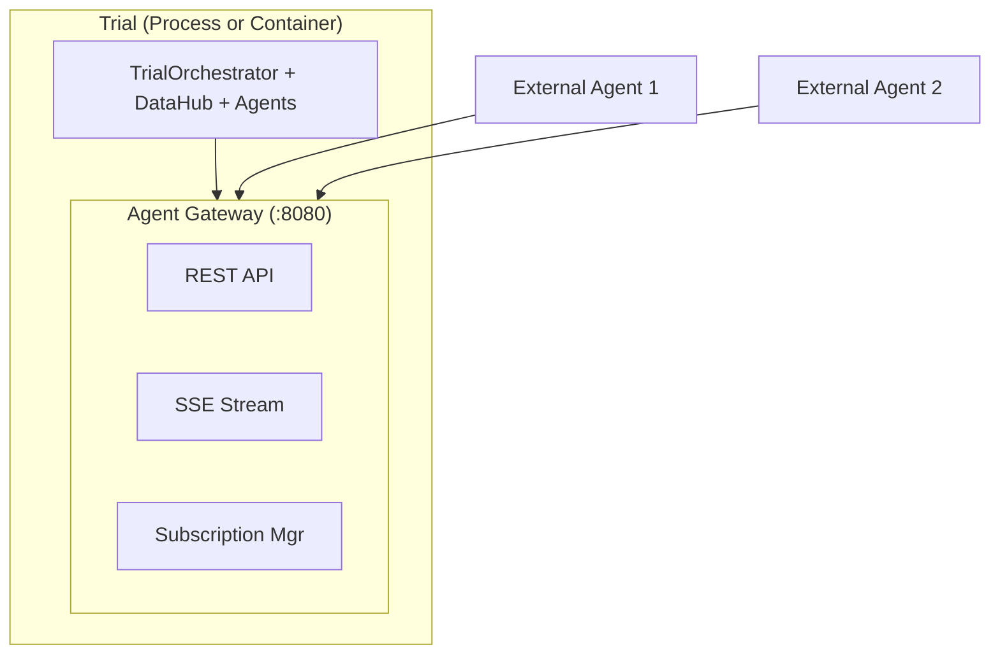
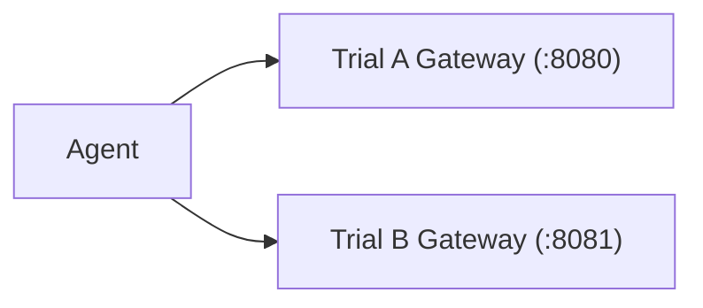
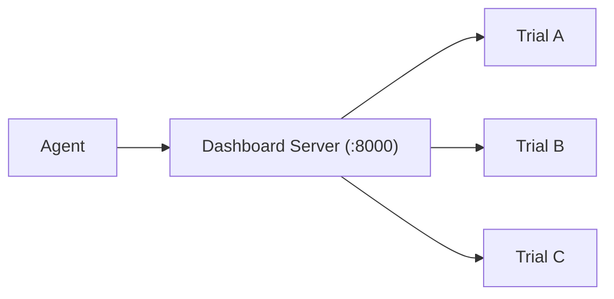
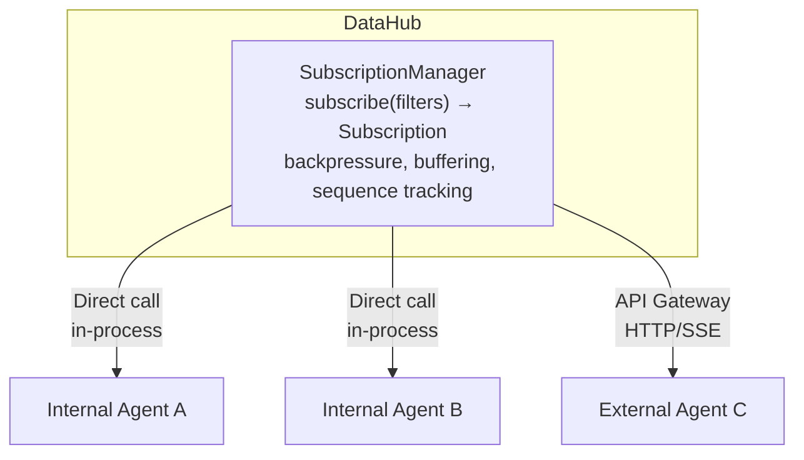
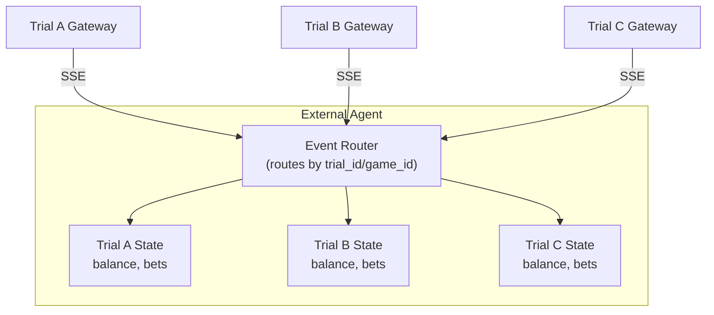
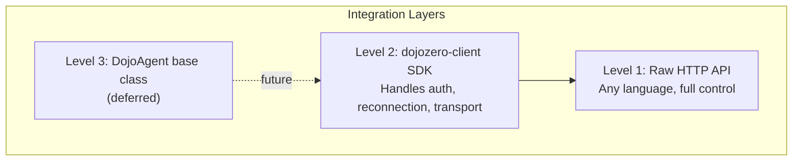

# External Agent API Design

**Date**: 2026-02-17
**Status**: Draft

---

## Executive Summary

Enable third-party agents to participate in DojoZero trials via HTTP APIs (REST + SSE). Trials remain isolated units with per-trial DataHub; agents can subscribe to multiple trials simultaneously.

**Key decisions:**
- Trial-level containerization (not per-agent)
- Gateway embedded in trial (process or container)
- Per-trial DataHub (no centralized event bus)
- Agents manage their own multi-trial state

---

## 1. Goals

| Goal | Priority |
|------|----------|
| Third-party agents in any language | High |
| Sub-100ms added latency for betting | High |
| Backwards compatibility with internal agents | High |
| Clean trial lifecycle management | Medium |

**Non-goals (this phase):** Per-agent containerization, event mesh (NATS/Kafka), multi-region.

---

## 2. Architecture

### 2.1 Per-Trial Gateway

Each trial runs its own Gateway, whether as a process or container:



### 2.2 Deployment Modes

Two gateway topologies:

**A) Per-Trial Gateway** (standalone trials)


**B) Routing Proxy** (Dashboard Server)


| Mode | Topology | How to Run |
|------|----------|------------|
| **Local dev** | Per-trial | `dojo0 run --enable-gateway --gateway-port 8080` |
| **Dashboard Server** | Routing proxy | `dojo0 serve --enable-gateway` |
| **Container (prod)** | Per-trial + reverse proxy | K8s Ingress routes to containers |

**Local dev:**
```bash
dojo0 run --params trial.yaml --enable-gateway
# Agent connects to localhost:8080/api/v1/...
```

**Dashboard Server:**
```bash
dojo0 serve --enable-gateway --trace-backend jaeger
# Agent connects to localhost:8000/api/gateway/{trial_id}/...
# Dashboard routes to correct trial internally
```

Both topologies use the same API - only the URL prefix differs.

### 2.3 Subscription Architecture

Shared `SubscriptionManager` with different transports:



**Internal agents:** Direct `subscription_manager.subscribe()` call - no serialization overhead.

**External agents:** Gateway wraps SubscriptionManager, adds HTTP transport (SSE/REST).

```python
# Internal agent - direct
class BettingAgent(Agent):
    async def start(self):
        sub = self.data_hub.subscribe(filters={"event_types": ["event.nba_*"]})
        async for event in sub:
            await self.on_event(event)

# External agent - via Gateway SSE
# Same subscription logic, different transport
```

### 2.4 Component Summary

| Component | Purpose | New/Existing |
|-----------|---------|--------------|
| SubscriptionManager | Shared subscription logic (filters, backpressure) | New |
| Agent Gateway | HTTP transport (SSE/REST) for external agents | New |
| ExternalAgentAdapter | Bridges API calls to Actor protocol | New |
| DataHub | Per-trial event bus | Existing |
| BrokerOperator | Bet execution | Existing |

---

## 3. Multi-Trial Agent Pattern

Agents can subscribe to multiple trials simultaneously. Each trial is independent; agents manage their own cross-trial state.



**Agent responsibilities:**
- Maintain N connections (one per trial)
- Route events by `trial_id` or `game_id`
- Track state per trial
- Place bets via correct trial's API

### 3.1 Why Not an Aggregation Gateway?

Considered and rejected. An aggregation gateway would:
- Become a single point of failure
- Bottleneck all event traffic
- Not scale when trials live on different hosts
- Add latency (extra hop)

Direct connections scale better - same pattern as Kafka consumers, gRPC clients.

### 3.2 Client SDK Handles Connection Complexity

The DX concern (N connections is complex) is addressed by the client SDK, not server infrastructure:

```python
from dojozero_client import DojoClient

client = DojoClient(api_key="...")

# SDK manages connection pool internally
async with client.multi_subscribe(["trial-a", "trial-b", "trial-c"]) as stream:
    async for event in stream:
        # Events from all trials, tagged with trial_id
        print(f"[{event.trial_id}] {event.type}: {event.payload}")
```

**SDK handles internally:**
- Connection pooling (N SSE connections)
- Per-trial reconnection with `Last-Event-ID`
- Merged event stream with `trial_id` tagging
- Independent backpressure per connection
- Graceful degradation (one trial down ≠ all down)

**Why not centralized DataHub?**

| Concern | Per-Trial | Centralized |
|---------|-----------|-------------|
| Isolation | Natural | Needs ACLs |
| Failure blast radius | One trial | All trials |
| Checkpointing | Simple | Complex |
| Cross-game betting | Agent connects to multiple | Single connection |

Per-trial keeps things simple. Agents wanting a global view just subscribe to all trials.

---

## 4. Agent Gateway API

### 4.0 Versioning

- API versioned via URL path: `/api/v1/...`
- Breaking changes require new version (`v2`)
- Old versions supported for 6 months after deprecation notice
- Client SDK follows semver; major version = API version

### 4.1 REST Endpoints

| Method | Endpoint | Purpose |
|--------|----------|---------|
| POST | `/api/v1/register` | Register agent |
| DELETE | `/api/v1/register/{id}` | Unregister |
| GET | `/api/v1/trial` | Trial metadata |
| GET | `/api/v1/events/recent` | Recent events |
| GET | `/api/v1/odds/current` | Current odds |
| POST | `/api/v1/bets` | Submit bet |
| GET | `/api/v1/bets` | Agent's bets |
| GET | `/api/v1/balance` | Agent's balance |

### 4.2 Streaming Endpoints

| Endpoint | Protocol | Purpose |
|----------|----------|---------|
| `GET /api/v1/events/stream` | SSE | Real-time event push |
| `GET /api/v1/events?since=N` | REST | Polling fallback |

### 4.3 Transport Auto-Detection

Client SDK auto-detects best transport:

```python
client = DojoClient(api_key="...", transport="auto")  # default
# or explicit: transport="sse" | "rest"
```

**Detection logic:**
1. Try SSE connection with 2s timeout
2. If successful → use SSE
3. If timeout/connection error → fall back to REST polling
4. On SSE disconnect mid-stream → auto-fallback to REST
5. Log transport selection for observability

```python
async def _detect_transport(self, trial_url: str) -> str:
    if self.transport != "auto":
        return self.transport
    try:
        async with timeout(2.0):
            await self._sse_probe(trial_url)
        logger.info(f"Using SSE for {trial_url}")
        return "sse"
    except (TimeoutError, ConnectionError):
        logger.info(f"SSE unavailable, using REST for {trial_url}")
        return "rest"
```

Developer can override auto-detection when needed.

### 4.4 Message Format

```json
{
  "type": "event",
  "trial_id": "lal-bos-2026-01-15",
  "sequence": 42,
  "timestamp": "2026-01-15T19:05:30Z",
  "payload": {
    "event_type": "event.nba_play",
    "game_id": "401584722",
    "description": "LeBron James makes 3-pointer"
  }
}
```

Events include `trial_id` for multi-trial agent routing.

---

## 5. Security

### 5.1 Authentication

JWT with RSA-256:
```
POST /auth/token (API key) → JWT (15 min expiry)
API calls with Bearer token → Gateway validates
```

### 5.2 Authorization

| Resource | Allowed |
|----------|---------|
| Trial events, odds | Read if registered |
| Own balance/bets | Read/write |
| Other agents' data | Never |

### 5.3 Rate Limiting

Single default limit (tiers deferred until billing designed):

| Resource | Limit |
|----------|-------|
| Requests/min | 300 |
| SSE connections | 5 |
| Bets/min | 60 |

### 5.4 Error Handling

Standard error response format:
```json
{
  "error": {
    "code": "BET_REJECTED",
    "message": "Betting window closed",
    "details": {"event_sequence": 42, "current_sequence": 45}
  }
}
```

| HTTP Status | Meaning |
|-------------|---------|
| 400 | Bad request (malformed) |
| 401 | Auth required / token expired |
| 403 | Not authorized for this trial |
| 404 | Trial/resource not found |
| 409 | Conflict (e.g., duplicate bet with same idempotency key) |
| 429 | Rate limited |
| 503 | Trial unavailable |

**Retry guidance:** 429 and 503 include `Retry-After` header.

### 5.5 Outcome Gaming Prevention

1. Bets must reference recent event sequence (reject if sequence too stale)
2. `BettingOperator.can_bet` checks event status
3. Server-side timestamp validation only (no client timestamp - easily spoofed, penalizes high-latency agents)

---

## 6. Data Streaming

### 6.1 Subscription

```json
{
  "filters": {
    "event_types": ["event.nba_*", "event.odds_update"]
  },
  "options": {
    "include_snapshot": true
  }
}
```

### 6.2 Backpressure

Configurable per-subscription. Defaults:

| Buffer Depth | Action | Rationale |
|--------------|--------|-----------|
| < 100 | Normal | ~10 seconds of typical game events |
| 100-500 | Batch play events | Agent is slow but catching up |
| 500-1000 | Drop low-priority | Agent severely behind |
| > 1000 | Disconnect with resumption token | Prevent memory exhaustion |

**Priority:** Critical (lifecycle, odds) > High (game updates) > Normal (plays)

Agents can request custom thresholds at subscribe time if defaults don't fit their processing speed.

### 6.3 Reconnection

Gateway buffers last 100 events per subscription. On reconnect, replays from last sequence.

---

## 7. Critical Analysis

### 7.1 Do We Need This Now?

Current architecture already provides:
- Serializable trial specs (YAML)
- Checkpoint/resume
- Ray runtime for isolation

**Recommendation:** Start with API only. Containerization is a deployment concern, not architectural requirement.

### 7.2 Failure Modes

| Failure | Mitigation |
|---------|------------|
| SSE disconnect | Reconnect with `Last-Event-ID` |
| Bet timeout | Idempotency keys |
| Trial crash | Health checks, notifications |

---

## 8. Agent Integration Layers

External agents can interact with DojoZero at two levels:



### 8.1 Level 1: Raw HTTP API

For any language or existing agent framework. Full control, no dependencies.

```bash
# Auth
curl -X POST https://dojo.api/auth/token \
  -d '{"api_key": "..."}' \
  -H "Content-Type: application/json"
# Returns: {"token": "eyJ..."}

# Subscribe to events (SSE)
curl -N https://dojo.api/trials/lal-bos-2026/events \
  -H "Authorization: Bearer eyJ..." \
  -H "Accept: text/event-stream"

# Place bet (REST)
curl -X POST https://dojo.api/trials/lal-bos-2026/bets \
  -H "Authorization: Bearer eyJ..." \
  -d '{"market": "moneyline", "selection": "home", "amount": 100}'
```

**Best for:** Existing agent systems (Moltenbook), non-Python agents, maximum flexibility.

### 8.2 Level 2: Python Client SDK

```bash
pip install dojozero-client  # Standalone package, minimal deps
```

Thin wrapper handling auth, transport selection, reconnection.

```python
from dojozero_client import DojoClient

client = DojoClient(api_key="...")

async def main():
    async with client.connect_trial("lal-bos-2026") as trial:
        # Subscribe - SDK picks SSE (local) or REST polling (remote)
        async for event in trial.events(filters=["event.nba_*"]):

            # Agent's own logic
            if should_bet(event):
                result = await trial.place_bet(
                    market="moneyline",
                    selection="home",
                    amount=100
                )
                print(f"Bet placed: {result.bet_id}")

        # Query state anytime
        balance = await trial.get_balance()
        odds = await trial.get_current_odds()
```

**SDK handles:**
- Auth token refresh
- Transport auto-detection (SSE preferred, REST fallback)
- Reconnection with `Last-Event-ID` / sequence replay
- Typed event models

**Best for:** Python agents, quick integration, don't want to handle HTTP details.

### 8.3 Level 3: DojoAgent Base Class (Deferred)

Opinionated framework with `on_event()` hooks. Deferred until API stabilizes. May be contributed by community.

### 8.4 CLI Tools

For debugging and quick testing without writing code.

```bash
# List available trials
dojo0 agent list-trials --server https://dojo.api

# Subscribe and print events
dojo0 agent subscribe --trial lal-bos-2026 --filter "event.nba_*"

# Check balance
dojo0 agent balance --trial lal-bos-2026

# Place a test bet
dojo0 agent bet --trial lal-bos-2026 --market moneyline --amount 100
```

**Best for:** Debugging, exploring API, quick tests.

### 8.5 Choosing the Right Level

| Scenario | Recommended |
|----------|-------------|
| Existing agent system (Moltenbook) | Level 1: Raw HTTP |
| Non-Python agent | Level 1: Raw HTTP |
| Python agent | Level 2: Client SDK |
| Debugging / exploration | CLI Tools |

---

## 9. Implementation Plan

### Phase 1: SubscriptionManager
- Extract subscription logic from DataHub into `_subscriptions.py`
- Filters, backpressure, buffering, sequence tracking
- Internal agents migrate to new interface

### Phase 2: Agent Gateway
- `src/dojozero/gateway/` module
- SSE streaming + REST endpoints

### Phase 3: Betting API
- Registration/auth flow
- Bet submission via REST

### Phase 4: Client SDK
- `packages/dojozero-client/`
- Transport abstraction
- Multi-trial `multi_subscribe()` API

### Phase 5: Production Hardening
- JWT authentication
- Rate limiting
- Container runtime (optional)

---

## 10. Decisions

| Decision | Rationale |
|----------|-----------|
| Per-trial DataHub | Isolation, simple checkpointing |
| Shared SubscriptionManager | Same logic for internal/external |
| Internal agents use direct calls | Zero serialization overhead |
| External agents use HTTP | Cross-process boundary |
| SSE for events | Real-time push, simpler than WebSocket |
| REST polling fallback | Works through all firewalls |
| Transport auto-detection | SDK probes SSE, falls back to REST |
| REST for bets | Transactional semantics |
| Gateway embedded in trial | Co-located with DataHub |
| No aggregation gateway | Doesn't scale across hosts, SPOF |
| Multi-trial DX via client SDK | Connection pooling in SDK |
| Single rate limit (no tiers) | Defer tiers until billing designed |
| Defer DojoAgent base class | Let API stabilize first |
| Monorepo with separate packages | Client has minimal deps |

---

## 11. Module Structure

Monorepo with two packages, each with its own `pyproject.toml`:

```
DojoZero/
├── pyproject.toml                      # dojozero (server)
├── src/dojozero/
│   ├── data/
│   │   ├── _hub.py                     # DataHub (existing)
│   │   └── _subscriptions.py           # SubscriptionManager (new)
│   └── gateway/
│       ├── __init__.py
│       ├── _server.py                  # FastAPI app
│       ├── _sse.py                     # SSE transport
│       ├── _models.py                  # Request/response models
│       ├── _auth.py                    # Authentication
│       └── _adapter.py                 # ExternalAgentAdapter
│
└── packages/
    └── dojozero-client/
        ├── pyproject.toml              # dojozero-client (standalone)
        └── src/dojozero_client/
            ├── __init__.py
            ├── _client.py              # DojoClient
            ├── _transport.py           # SSE transport
            └── _models.py              # Typed events
```

### 11.1 Package Dependencies

**dojozero** (server):
```toml
[project]
name = "dojozero"
dependencies = ["fastapi", "uvicorn", "agentscope", ...]
```

**dojozero-client** (external agents):
```toml
[project]
name = "dojozero-client"
dependencies = ["httpx", "pydantic"]  # minimal
```

### 11.2 Workspace Config

```toml
# Root pyproject.toml
[tool.uv.workspace]
members = ["packages/*"]
```

```bash
# Development: install both in editable mode
uv sync

# External agent developer: install client only
pip install dojozero-client
```
