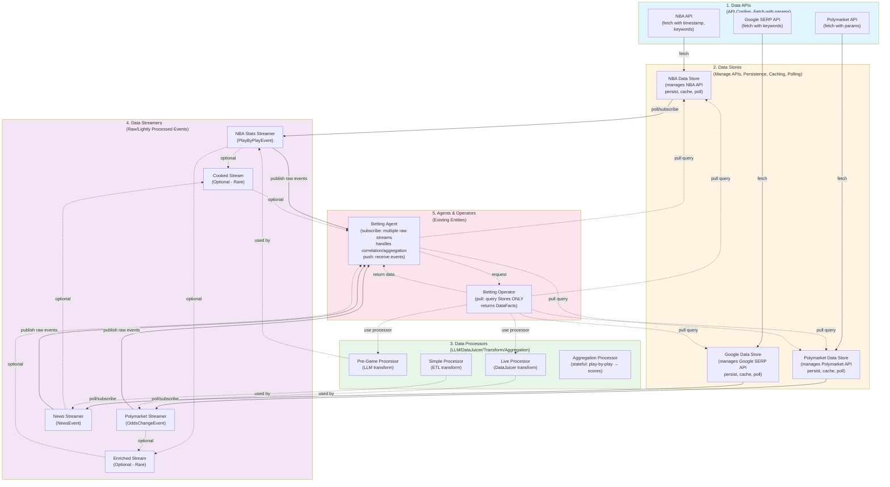

# Data Infrastructure Design (NBA betting for now)

## Scenario Overview

An agent bets on NBA games on Polymarket:
- **Pre-game**: Agent analyzes NBA API odds, team stats, schedule strength, news (Google Search API/News API) to make educated bets
- **In-game**: Agent uses play-by-play data (NBA API) and odds trends for incremental bets
- **Post-game**: Agent is rewarded based on game result

## Design Principles

1. **Support Pull and Push Models**: Agents can subscribe to push streams or trigger pull queries via operators
2. **Support Replay**: Streams and triggers can be replayed deterministically for backtesting
3. **LLM Integration**: Data transformation using DataJuicer or LLMs
4. **Separation of Concerns**: Data API management should be separated from data persistence/caching/replay logic

## Layered design

For system components, we have
1. Data API 
    - handles api configs
    - supports fetch, with timestamp, keyword, and related params
    - supports nba_api, polymarket api, google serp api for now
2. Data Store
    - manages Data API
    - handles data persistence, caching
    - does necessary polling to generate data streams
    - provides fetch/query functionality for operators; returns **DataFacts** (current state snapshots)
    - converts raw API responses to schema-based DataEvents (for streaming) and DataFacts (for queries)
    - maintains both: events (for history/replay) and current facts (for fast queries)
3. Data Processor
    - do necessary data processing; a function(stateless) or class (stateful)
    - can be used by data stream in streaming/push scenario, or operator in data pull scenario
    - using LLM or DataJuicer or simple transform
    - processes schema-based DataEvents, outputs schema-based events
    - supports aggregation (e.g., play-by-play → total scores)
        - **Stateless aggregation**: process batch of events and aggregate
        - **Stateful aggregation** : maintain running aggregates across events
        - state management handled by Data Streamer (since streamers are actors with state)
4. Data Streamer
    - actor
    - subscribe to data store, or another data stream (supports multiple input streams)
    - uses data processor to process data
    - publish schema-based **DataEvents** (changes/deltas) to downstream
    - can correlate/join events from multiple input streams (e.g., NBA stats + Polymarket odds)
    - emits typed events (e.g., EnrichedBettingEvent) based on event schemas
    - **Push-based**: streams events as changes occur 
5. Agents and Operators are the existing entities in the system
    - **Operators**: Pull **DataFacts** from Data Stores (current state snapshots)
    - **Agents**: Can subscribe to **DataEvents** (push/stream) or request **DataFacts** via Operators (pull) 

As for data artifacts, we have 
- **DataFact**: Pull-based snapshots representing current state at a point in time
- **DataEvent**: Push-based changes representing updates/deltas in the system
- **DataEventStream**: Stream of DataEvents

## Data Facts vs Data Events

The system differentiates between two types of data artifacts:

### Data Facts (Pull-Based)
- **Purpose**: Represent current state/snapshots at a point in time
- **Access Pattern**: Pull/query on-demand via Operators or direct Data Store queries
- **Use Cases**: 
  - "What is the current score?" → `GameScoreFact`
  - "What are the current odds?" → `OddsFact`
  - "What is the current game status?" → `GameStatusFact`
- **Characteristics**:
  - Snapshot of current state
  - No change history (just current value)
  - Synchronous/blocking queries
  - Used when agent needs current state for decision-making

### Data Events (Push-Based)
- **Purpose**: Represent changes/deltas in the system
- **Access Pattern**: Push/stream via Data Streamers
- **Use Cases**:
  - "Score changed from 44-42 to 45-42" → `PlayByPlayEvent`
  - "Odds moved from 1.80 to 1.85" → `OddsChangeEvent`
  - "Player injured" → `InjuryEvent`
- **Characteristics**:
  - Represents a change/delta
  - Includes before/after state (for change events)
  - Asynchronous/streaming
  - Used for reactive/event-driven agent behavior

### Relationship Between Facts and Events
- **Facts can be derived from Events**: Current state = initial state + sum of all events
- **Events can be derived from Facts**: Change event = new fact - previous fact
- **Data Stores maintain both**:
  - Store events for replay/history
  - Maintain current facts (derived from events) for fast queries
- **Agents can use both**:
  - Pull facts for initial state or on-demand queries
  - Subscribe to events for reactive updates

### Analysis: Should We Separate Facts and Events?

**Question**: Is there an advantage to separating data into DataFacts (pull-based snapshots) and DataEvents (push-based deltas)?

#### Advantages of Separation

1. **Semantic Clarity**
   - ✅ Clear distinction: Facts = "what is", Events = "what changed"
   - ✅ Different schemas optimized for different use cases
   - ✅ Facts don't need "before" state, events do

2. **Access Pattern Optimization**
   - ✅ **Facts**: Optimized for fast, one-time queries (cached, indexed)
   - ✅ **Events**: Optimized for streaming (buffered, ordered)
   - ✅ Different storage/retrieval strategies

3. **Performance Benefits**
   - ✅ Facts can be materialized/cached independently
   - ✅ Agents pulling current state don't need to replay all events
   - ✅ Facts can use different indexes (e.g., by game_id, by timestamp)

4. **Use Case Alignment**
   - ✅ **Pull queries**: "What is the current score?" → Fast fact lookup
   - ✅ **Push streams**: "Score changed" → Event stream
   - ✅ Different query patterns benefit from different data structures

5. **Schema Simplicity**
   - ✅ Facts: Simple state snapshots (no change tracking)
   - ✅ Events: Change-focused (before/after, deltas)
   - ✅ Each schema optimized for its purpose

#### Disadvantages of Separation

1. **Complexity**
   - ❌ Two types to maintain, two sets of schemas
   - ❌ Need to keep facts and events in sync
   - ❌ More code paths to test and maintain

2. **Potential Duplication**
   - ❌ Facts can be derived from events (redundancy)
   - ❌ Risk of inconsistency if facts aren't updated correctly
   - ❌ Storage overhead (though facts are typically small)

3. **Consistency Challenges**
   - ❌ Facts must be kept in sync with events
   - ❌ What happens if fact update fails but event succeeds?
   - ❌ Need transaction/consistency guarantees

4. **Alternative: Events-Only Approach**
   - ✅ Could use events only: "current state" = latest event or snapshot event
   - ✅ Simpler: one type, one set of schemas
   - ✅ Agents can maintain their own state from events
   - ❌ But: Pull queries would need to replay events or maintain snapshots

#### Recommendation: **Keep Separation, But Simplify**

**Keep Facts and Events Separate Because**:
1. **Performance**: Pull queries for current state are common and benefit from optimized fact storage
2. **Semantic Clarity**: The distinction matches real-world use cases (current state vs changes)
3. **Optimization**: Facts can be cached/indexed differently than events

**But Simplify**:
1. **Minimal Fact Types**: Only provide facts for commonly queried state (score, odds, game status)
2. **Derive Facts from Events**: Facts are always derived from events, never independent
3. **Single Source of Truth**: Events are the source of truth; facts are materialized views
4. **Agent Flexibility**: Agents can still subscribe to events and maintain their own state

**Alternative Consideration**: If pull queries are rare, could use **Events-Only** approach:
- Agents subscribe to events and maintain their own state
- For pull queries, agents can query their own state or replay events
- Simpler architecture, but agents need to handle state management

**Decision**: **Keep separation** for this use case because:
- Betting agents frequently need current state (score, odds) for decision-making
- Pull queries are synchronous and benefit from fast fact lookups
- The performance and clarity benefits outweigh the complexity cost
- Facts are simple materialized views, not independent data sources

### Philosophy: Minimal Derived Events/Facts, Agent-Driven Reasoning

**Design Principle**: The data infrastructure should provide **raw and lightly processed** data points. Agents handle aggregation, correlation, and reasoning logic themselves.

**Why**:
- **Agent Autonomy**: Different agents have different reasoning strategies and aggregation needs
- **Flexibility**: Agents can combine raw data streams in ways that match their specific logic
- **Separation of Concerns**: Data infrastructure provides data; agents provide intelligence
- **Avoid Over-Engineering**: Don't pre-compute aggregations that may not be useful to all agents

**What the Data Layer Provides**:
- ✅ **Raw Events**: `PlayByPlayEvent`, `OddsChangeEvent`, `InjuryEvent`, `NewsEvent` (direct from APIs)
- ✅ **Basic Facts**: `GameScoreFact`, `OddsFact`, `GameStatusFact` (current state snapshots)
- ✅ **Light Processing**: Basic validation, schema enforcement, timestamp normalization
- ✅ **Multi-Stream Support**: Agents can subscribe to multiple raw streams simultaneously

**What Agents Handle**:
- ✅ **Aggregation**: Agents aggregate play-by-play events to compute running scores, stats, trends
- ✅ **Correlation**: Agents correlate events from multiple streams (e.g., score changes + odds changes)
- ✅ **Reasoning**: Agents reason about what events mean for betting decisions
- ✅ **Derived State**: Agents maintain their own derived state (e.g., "momentum", "value opportunities")

**When to Use Derived Events/Facts in Data Layer**:
- ✅ **Reusable Transformations**: Only when the transformation is useful for **multiple agents**
- ✅ **Performance**: When the transformation is computationally expensive and benefits from caching
- ✅ **Data Quality**: When the transformation improves data quality (e.g., deduplication, normalization)
- ❌ **Avoid**: Agent-specific aggregations, business logic, decision-making helpers

**Example**:
- ✅ **Data Layer**: Provides `PlayByPlayEvent` (raw play data)
- ✅ **Agent**: Subscribes to `PlayByPlayEvent` stream, aggregates to track score, computes momentum
- ❌ **Data Layer**: Should NOT provide `GameMomentumEvent` (too agent-specific)
- ✅ **Data Layer**: Could provide `GameScoreFact` (basic current state, useful for many agents)

## Data Schemas

All DataFacts and DataEvents follow a schema-based approach using data classes/schemas. This provides:
- **Type Safety**: Clear structure and validation for each fact/event type
- **Agent Clarity**: Agents can easily understand and process structured data
- **Evolution**: Easier to evolve from schema-based to schema-less if needed
- **Validation**: Automatic validation of fact/event structure
- **Documentation**: Schemas serve as self-documenting contracts

### Base Structures

#### Base DataFact Structure

All facts inherit from a base `DataFact` structure:

```python
@dataclass
class DataFact:
    fact_type: str  # e.g., "game_score", "current_odds", "team_stats"
    timestamp: datetime  # When this fact was captured/current as of
    game_id: str | None  # Optional, for game-related facts
    metadata: dict[str, Any]  # Additional context
    payload: Any  # Type-specific payload
```

#### Base DataEvent Structure

All events inherit from a base `DataEvent` structure:

```python
@dataclass
class DataEvent:
    event_type: str  # e.g., "play_by_play", "odds_change", "injury"
    timestamp: datetime  # When the change occurred
    game_id: str | None  # Optional, for game-related events
    metadata: dict[str, Any]  # Additional context
    payload: Any  # Type-specific payload
```

### DataFact Type Schemas

#### 1. GameScoreFact
Current game score snapshot:

```python
@dataclass
class GameScoreFact(DataFact):
    fact_type: str = "game_score"
    
    game_id: str
    home_team_id: str
    away_team_id: str
    home_score: int
    away_score: int
    period: int  # Current period/quarter
    period_time: str  # Time remaining in period
    game_status: str  # e.g., "live", "halftime", "finished"
    timestamp: datetime  # When this score was current
```

#### 2. OddsFact
Current betting odds snapshot:

```python
@dataclass
class OddsFact(DataFact):
    fact_type: str = "current_odds"
    
    market_id: str
    market_question: str
    game_id: str | None
    outcome: str  # e.g., "Yes", "No"
    current_odds: float  # Current odds (e.g., 1.85)
    volume_24h: float  # 24-hour trading volume
    liquidity: float  # Current market liquidity
    timestamp: datetime  # When these odds were current
```

#### 3. GameStatusFact
Current game status snapshot:

```python
@dataclass
class GameStatusFact(DataFact):
    fact_type: str = "game_status"
    
    game_id: str
    status: str  # e.g., "scheduled", "live", "halftime", "finished"
    scheduled_start: datetime
    actual_start: datetime | None
    ended_at: datetime | None
    home_score: int | None
    away_score: int | None
    venue: str
    timestamp: datetime
```

#### 4. TeamStatsFact
Current team statistics snapshot:

```python
@dataclass
class TeamStatsFact(DataFact):
    fact_type: str = "team_stats"
    
    team_id: str
    game_id: str | None  # If stats are game-specific
    period: int | None  # If stats are period-specific
    
    # Current stats
    points: int
    rebounds: int
    assists: int
    steals: int
    blocks: int
    turnovers: int
    fouls: int
    
    # Shooting percentages
    fg_percentage: float
    three_pt_percentage: float
    ft_percentage: float
    
    # Advanced metrics
    pace: float | None
    offensive_rating: float | None
    defensive_rating: float | None
    
    timestamp: datetime
```

#### 5. PlayerStatusFact
Current player status snapshot (including injuries):

```python
@dataclass
class PlayerStatusFact(DataFact):
    fact_type: str = "player_status"
    
    player_id: str
    player_name: str
    team_id: str
    game_id: str | None  # If player is in a game
    
    # Current status
    is_active: bool
    injury_status: str | None  # e.g., "questionable", "doubtful", "out"
    injury_type: str | None
    expected_return: datetime | None
    
    timestamp: datetime
```

### DataEvent Type Schemas

### Event Type Schemas

#### 1. PlayByPlayEvent
Represents individual play-by-play events from NBA games:

```python
@dataclass
class PlayByPlayEvent(DataEvent):
    event_type: str = "play_by_play"
    
    # Game context
    game_id: str
    period: int  # Quarter/period number
    period_time: str  # Time remaining in period (e.g., "10:23")
    game_time: datetime  # Absolute game time
    
    # Play details
    play_type: str  # e.g., "shot", "foul", "timeout", "substitution"
    team_id: str  # Team that made the play
    player_id: str | None  # Player involved (if applicable)
    
    # Scoring
    points: int  # Points scored (0, 1, 2, 3)
    home_score: int  # Home team score after play
    away_score: int  # Away team score after play
    
    # Play description
    description: str  # Human-readable description
    
    # Additional context
    shot_type: str | None  # e.g., "2PT Field Goal", "3PT Field Goal", "Free Throw"
    shot_distance: float | None  # Distance in feet
    is_made: bool | None  # Whether shot was made (for shot plays)
```

#### 2. OddsChangeEvent
Represents changes in betting odds from Polymarket:

```python
@dataclass
class OddsChangeEvent(DataEvent):
    event_type: str = "odds_change"
    
    # Market context
    market_id: str  # Polymarket market identifier
    market_question: str  # e.g., "Will Team A win?"
    game_id: str | None  # Associated NBA game (if applicable)
    
    # Odds details
    outcome: str  # e.g., "Yes", "No", or specific outcome
    previous_odds: float  # Previous odds (e.g., 1.85)
    current_odds: float  # Current odds (e.g., 1.92)
    odds_change: float  # Change in odds (current - previous)
    odds_change_percent: float  # Percentage change
    
    # Market metrics
    volume_24h: float | None  # 24-hour trading volume
    liquidity: float | None  # Current market liquidity
    
    # Timestamp
    timestamp: datetime  # When odds changed
```

#### 3. InjuryEvent
Represents player injury updates:

```python
@dataclass
class InjuryEvent(DataEvent):
    event_type: str = "injury"
    
    # Player context
    player_id: str
    player_name: str
    team_id: str
    game_id: str | None  # If injury occurs during a game
    
    # Injury details
    injury_type: str  # e.g., "ankle", "knee", "concussion"
    severity: str  # e.g., "questionable", "doubtful", "out"
    status: str  # e.g., "active", "inactive", "day-to-day"
    
    # Timing
    occurred_at: datetime  # When injury occurred
    reported_at: datetime  # When injury was reported
    expected_return: datetime | None  # Expected return date (if known)
    
    # Additional context
    description: str  # Detailed description
    source: str  # Source of injury report (e.g., "team", "nba", "media")
```

#### 4. GameStatusEvent
Represents game state changes (start, end, delays):

```python
@dataclass
class GameStatusEvent(DataEvent):
    event_type: str = "game_status"
    
    game_id: str
    
    # Status details
    status: str  # e.g., "scheduled", "live", "halftime", "finished", "postponed"
    previous_status: str | None  # Previous status
    
    # Game timing
    scheduled_start: datetime
    actual_start: datetime | None  # When game actually started
    ended_at: datetime | None  # When game ended
    
    # Current score (if game is live/finished)
    home_score: int | None
    away_score: int | None
    
    # Additional context
    delay_reason: str | None  # If postponed/delayed
    venue: str  # Game venue
```

#### 5. NewsEvent
Represents news articles or updates:

```python
@dataclass
class NewsEvent(DataEvent):
    event_type: str = "news"
    
    # Article details
    article_id: str
    title: str
    content: str | None  # Full content or summary
    url: str
    source: str  # News source (e.g., "ESPN", "The Athletic")
    
    # Relevance
    game_id: str | None  # Related game
    team_ids: list[str]  # Related teams
    player_ids: list[str]  # Related players
    
    # Sentiment (if processed)
    sentiment: str | None  # e.g., "positive", "negative", "neutral"
    sentiment_score: float | None  # Numeric sentiment score
    
    # Timing
    published_at: datetime
    discovered_at: datetime  # When our system discovered it
```

#### 6. TeamStatsEvent
Represents team statistics updates:

```python
@dataclass
class TeamStatsEvent(DataEvent):
    event_type: str = "team_stats"
    
    team_id: str
    game_id: str | None  # If stats are game-specific
    
    # Statistical categories
    points: int
    rebounds: int
    assists: int
    steals: int
    blocks: int
    turnovers: int
    fouls: int
    
    # Shooting percentages
    fg_percentage: float  # Field goal percentage
    three_pt_percentage: float  # Three-point percentage
    ft_percentage: float  # Free throw percentage
    
    # Advanced metrics
    pace: float | None  # Possessions per 48 minutes
    offensive_rating: float | None
    defensive_rating: float | None
    
    # Context
    period: int | None  # If stats are period-specific
    timestamp: datetime
```

### Schema Usage Throughout System

1. **Data Stores**: 
    - Convert raw API responses to schema-based **DataEvents** (for streaming)
    - Maintain current **DataFacts** (state snapshots) for fast queries
    - Store both events (for history) and facts (for current state)
2. **Data Processors**: Transform/validate **DataEvents** and **DataFacts** using schemas
3. **Data Streamers**: Publish typed **DataEvents** (changes/deltas), can filter/route by event type
4. **Agents**: 
    - Receive strongly-typed **DataEvents** via subscription (push/stream)
    - Can pattern match on event types for reactive behavior
5. **Operators**: Return schema-based **DataFacts** (current state) when pulling data
6. **Persistence**: Store both events and facts with schema versioning for evolution

### When to Use DataFacts vs DataEvents

**Use DataFacts (Pull) when**:
- Agent needs current state for decision-making
- "What is the current score?" → Pull `GameScoreFact`
- "What are the current odds?" → Pull `OddsFact`
- Synchronous/blocking queries are acceptable
- Agent needs a snapshot at a specific point in time
- Initial state setup before subscribing to events

**Use DataEvents (Push) when**:
- Agent needs to react to changes
- "Score changed" → Receive `PlayByPlayEvent`
- "Odds moved" → Receive `OddsChangeEvent`
- Asynchronous/streaming is preferred
- Agent needs to track changes over time
- Event-driven/reactive agent behavior

**Hybrid Approach**:
- Pull **DataFacts** for initial state, then subscribe to **DataEvents** for updates
- Example: Pull current score fact, then subscribe to play-by-play events for score changes
- Best of both worlds: current state + change tracking

### Schema Evolution

- Schemas can evolve by adding optional fields
- Version field in metadata for backward compatibility
- Schema registry for validation and migration
- Support for schema-less mode (JSON blob) when needed for flexibility
- Both **DataFacts** and **DataEvents** follow same evolution strategy

## Component Architecture Diagram



### Key Flows

**Push Flow (Streaming - DataEvents)**:
1. **Data Store** polls **Data API** periodically
2. **Data Store** detects changes and creates **DataEvents** (deltas/changes)
3. **Data Store** persists events and updates current **DataFacts** (state snapshots)
4. **Data Streamer** subscribes to **Data Store** (or another streamer, or multiple streams)
5. **Data Streamer** receives **DataEvents** from input streams (buffers if multiple inputs)
6. **Data Streamer** uses **Data Processor** to transform/correlate events
7. **Data Streamer** publishes **DataEvent** (change/delta) to downstream (agents or other streamers)
8. **Agent** receives push **DataEvents** via subscription (reactive/event-driven)

**Pull Flow (On-Demand - DataFacts)**:
1. **Agent** requests **Operator** to pull current state
2. **Operator** queries **Data Store** (fetch/query for current state)
3. **Data Store** returns **DataFacts** (current state snapshots, e.g., current score, current odds)
4. **Operator** optionally uses **Data Processor** to transform pulled facts
5. **Operator** returns **DataFacts** to **Agent** (synchronous/blocking)
6. **Agent** can also pull **DataFacts** directly from **Data Store** if needed
7. **Use Case**: Agent needs current state for decision-making (e.g., "what is the current score?")

**Replay Flow**:
1. **Data Store** queries historical **DataEvents** using timestamps
2. **Data Streamer** replays **DataEvents** from historical data (reconstructs event stream)
3. **Operator** pulls historical **DataFacts** at specific timestamps (reconstructs state at that time)
4. All flows respect simulation time for deterministic replay
5. **Note**: Events can be replayed to reconstruct facts at any point in time

**Aggregation Patterns**:
- **Stateless Aggregation** (Pull/Operator scenario):
    - Operator queries Data Store for a batch of **DataEvents** (e.g., all play-by-play events for a game)
    - Data Processor aggregates the batch (e.g., sum scores) and returns **DataFact** (current aggregate)
    - No state persistence needed
    - Returns **DataFact** representing aggregated state
- **Stateful Aggregation** (Streaming scenario):
    - Data Streamer receives individual **DataEvents** (e.g., each play-by-play event)
    - Stateful Data Processor maintains running aggregates (e.g., current game score)
    - State managed by Data Streamer (since streamers are actors with `save_state`/`load_state`)
    - Aggregated results published as new **DataEvents** downstream (change events)
    - Can also emit **DataFacts** periodically (snapshot of current aggregate state)
- **Implementation**: Aggregation is handled as a Data Processor implementation detail; no special architectural changes needed

**Multi-Input Stream Scenarios**:
Agents should handle most multi-stream correlation and aggregation. Data Streamers should only provide minimal, reusable transformations.

**Preferred Approach: Agent-Driven Correlation**:
- **Agents subscribe to multiple raw streams** (`PlayByPlayEvent`, `OddsChangeEvent`, `NewsEvent`, etc.)
- **Agents handle correlation** using their own logic and state
- **Agents aggregate** events to compute derived metrics (scores, trends, momentum)
- **Agents reason** about what events mean for their betting strategy

**Example - Agent-Driven Approach**:
```python
# Agent subscribes to multiple raw streams
agent.subscribe(play_by_play_stream)  # Receives PlayByPlayEvent
agent.subscribe(odds_stream)           # Receives OddsChangeEvent  
agent.subscribe(news_stream)           # Receives NewsEvent

# Agent maintains its own state and correlation logic
class BettingAgent:
    def handle_play_by_play(self, event: PlayByPlayEvent):
        self.update_score(event)
        self.compute_momentum()
        
    def handle_odds_change(self, event: OddsChangeEvent):
        self.track_odds_movement(event)
        self.correlate_with_score()  # Agent's own correlation logic
        
    def handle_news(self, event: NewsEvent):
        self.update_sentiment(event)
        self.evaluate_betting_opportunity()  # Agent's reasoning
```

**When Data Streamers Should Handle Multi-Input** (Rare - Only for Reusable Infrastructure):

1. **Data Quality / Normalization**:
    - **Example**: Streamer deduplicates events, normalizes timestamps, validates schemas
    - **Why Streamer**: Improves data quality for all downstream consumers
    - **Not**: Agent-specific correlation or business logic

2. **Basic Joining for Performance** (Only if computationally expensive):
    - **Example**: Joining events by timestamp/game_id when the join is expensive
    - **Why Streamer**: Performance optimization, reusable across agents
    - **Note**: Most agents can handle this themselves; only use if proven bottleneck

3. **Event Synchronization** (Data Completeness):
    - **Example**: Ensuring events from multiple sources are synchronized before emitting
    - **Why Streamer**: Data infrastructure concern, not business logic
    - **Note**: Agents can also handle this with their own buffering

**Avoid in Data Streamers**:
- ❌ Agent-specific aggregations (e.g., "momentum", "value opportunities")
- ❌ Business logic correlations (e.g., "bet when X and Y conditions met")
- ❌ Derived metrics that only some agents need
- ❌ Pre-computed insights that agents should reason about themselves

**Implementation Considerations for Multi-Input Streams**:
- **Buffering**: Streamer maintains separate buffers/queues per input stream
- **Correlation Keys**: Events matched by keys (game_id, timestamp, player_id, etc.)
- **Time Windows**: For time-based correlation (e.g., match events within 5-second window)
- **Partial Data Handling**: Strategy for when one stream has data but others don't (wait, emit partial, use last known value)
- **State Management**: Streamer state includes buffers and correlation state (managed via actor `save_state`/`load_state`)
- **Event Ordering**: Handle events arriving out of order from different streams

**When to Use Data Streamers vs Agents for Multi-Input Scenarios**:

**Default: Use Agents** (Preferred Approach):
- **Most correlation and aggregation should be handled by agents**
- Agents subscribe to multiple raw streams and correlate/aggregate using their own logic
- Agents maintain their own state, buffering, and correlation logic
- **Examples**:
    - ✅ **Score Tracking**: Agent subscribes to `PlayByPlayEvent` stream, aggregates to track current score
    - ✅ **Odds Correlation**: Agent subscribes to `PlayByPlayEvent` and `OddsChangeEvent`, correlates score changes with odds movements
    - ✅ **Multi-Stream Reasoning**: Agent subscribes to multiple streams, reasons about betting opportunities
    - ✅ **Derived Metrics**: Agent computes momentum, value opportunities, risk assessments

**Use Data Streamers Only When** (Rare - Minimal Transformations):
- **Data Quality**: Deduplication, normalization, schema validation (improves data for all agents)
- **Performance**: Only if correlation is proven computationally expensive bottleneck
- **Reusability**: Only if transformation is truly useful for multiple agents (not agent-specific)
- **Examples**:
    - ✅ **Data Quality**: Deduplicate events, normalize timestamps
    - ✅ **Basic Joining**: Join events by timestamp/game_id (only if expensive and reusable)
    - ❌ **Avoid**: Agent-specific aggregations, business logic, derived insights

**Recommendation**: 
- **Default**: Agents subscribe to raw streams and handle correlation/aggregation themselves
- **Data Streamers**: Only for minimal, reusable data infrastructure transformations
- **Keep it Simple**: Don't over-engineer derived events/facts; let agents reason with raw data

## Open questions
- unified event streaming for agent? even if triggered event, the data pull gets into the event stream
    operator data query should be syncrhnous/blocking
    incoming data from different streams could reside in the unified event queue/buffer
- how should the data event look like? all data points (play by play, odds) should be a json format blob? agent's job or data processors job to interpret the incoming stream and contextualize?
    ✅ **RESOLVED**: Use schema-based approach with data classes (see DataEvent Schemas section)
    - Different event types: PlayByPlayEvent, OddsChangeEvent, InjuryEvent, GameStatusEvent, NewsEvent, TeamStatsEvent, EnrichedBettingEvent
    - Schemas provide type safety, validation, and clarity for agents
    - Can evolve to schema-less (JSON blob) if needed for flexibility
- how do we support backtest, especially with data queries/pulls? snapshot data at different moments will be different; but a separate run, agent might use operator to pull different data?  
    no need for determinstic behavior during backtest; it's more for comparing different agents
    best effort event stream
- any scenario we would need multple sources/streams as DataStream input?
    yes - data enrichment/joining, cross-stream filtering, multi-source aggregation, event synchronization
    implementation: streamer maintains buffers per input stream, correlates by keys (game_id, timestamp), handles partial data
- any scenario that calls for data joining?
    ✅ **RESOLVED**: Yes - data joining is a key use case for multi-input Data Streamers
    - **EnrichedBettingEvent**: Join PlayByPlayEvent + OddsChangeEvent by timestamp/game_id
    - **TeamAnalyticsEvent**: Join TeamStatsEvent + PlayerStatsEvent + NewsEvent by team_id
    - **GameContextEvent**: Join GameStatusEvent + multiple PlayByPlayEvents for full game context
    - Implementation: Data Streamers handle joining logic, emit EnrichedBettingEvent or similar joined event types
    - Agents can also join events themselves if they need agent-specific joining logic
    