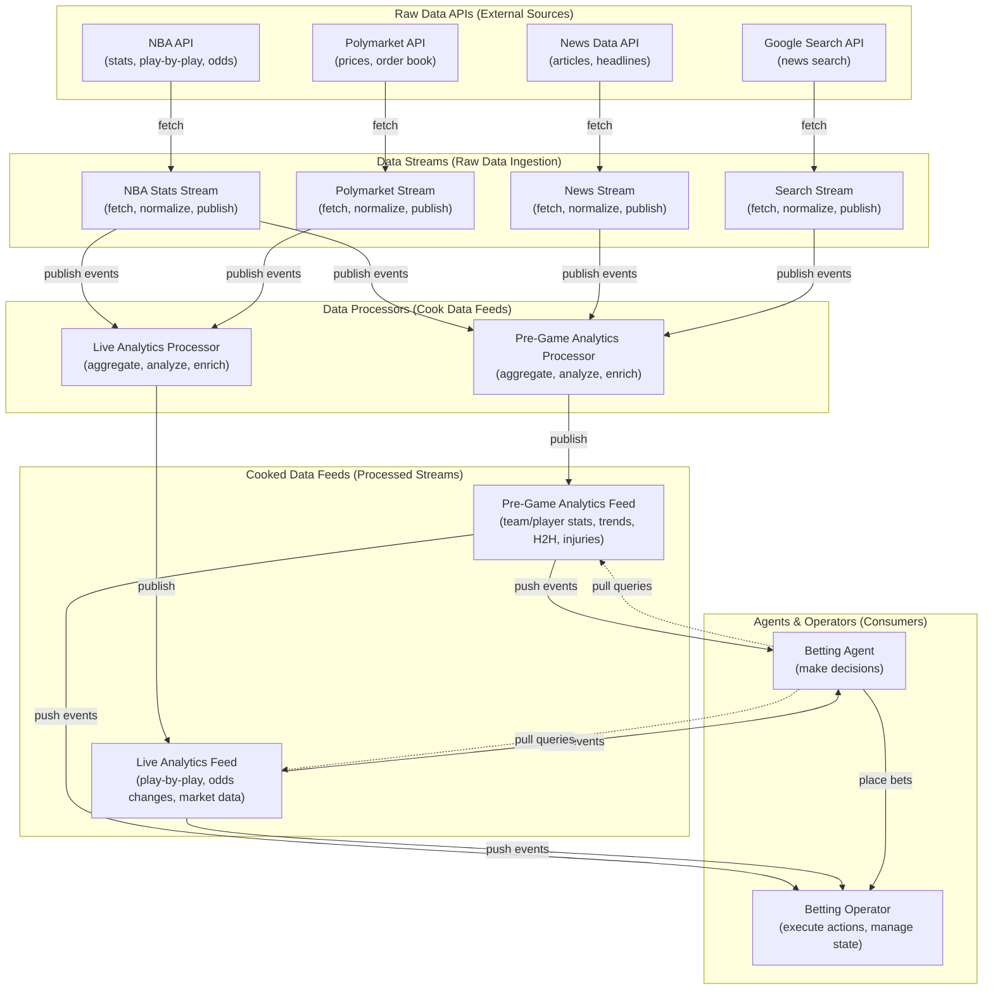
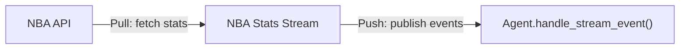
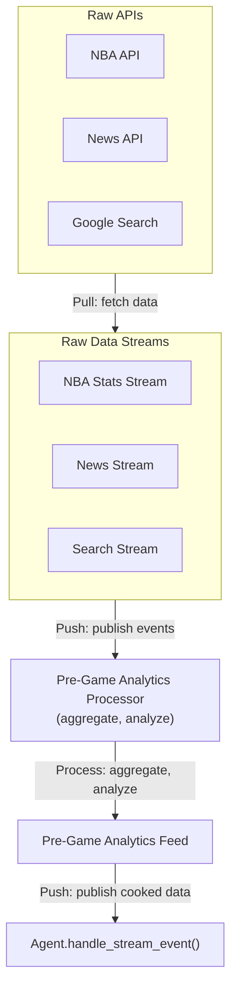
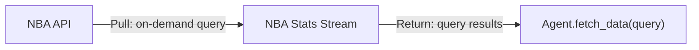

# Data Source Architecture Design

## Overview

AgentX needs to handle two distinct types of data sources:
1. **Raw Data APIs** - External APIs that provide unprocessed data
2. **Cooked Data Feeds** - Processed/aggregated data streams that combine multiple sources

This document defines how to properly model these different data signals and how agents and operators should work with them.

## Architecture Layers



## Data Source Types

### Type 1: Raw Data APIs

**Definition**: External APIs that provide unprocessed, raw data directly from source systems.

**Characteristics**:
- Direct API access
- Unprocessed data
- May require authentication
- Rate limits apply
- Push or Pull capable

**Available APIs**:
1. **NBA API** (`nba_api`)
   - Stats endpoints (team/player statistics)
   - Play-by-play data
   - Live scores
   - Odds data

2. **Polymarket API**
   - Market prices
   - Order book data
   - Volume data
   - Price history

3. **Google Search API**
   - News search results
   - Web search results

4. **News Data API**
   - News articles
   - Headlines
   - Sentiment data

### Type 2: Cooked Data Feeds

**Definition**: Processed, aggregated, and enriched data streams that combine multiple raw sources.

**Characteristics**:
- Derived from raw data
- Pre-computed analytics
- Enriched with context
- Optimized for consumption
- Push-based (reactive) or Pull-based (on-demand)

**Categories**:

#### 2.1 Pre-Game Analytics
- **Team Performance** (stats, trends)
- **Player Performance** (stats, trends)
- **Head-to-Head History**
- **Schedule Factors** (rest days, travel)
- **Injury Reports** (aggregated from multiple sources)
- **Analyst Predictions** (aggregated predictions)
- **Playoff Implications** (calculated stakes)
- **Historic Rivalry** (historical context)

#### 2.2 Live Data
- **Play-by-Play** (real-time game events)
- **Betting Odds Changes** (odds movement tracking)
- **Polymarket Odds Data** (market movements)

## Data Flow Patterns

### Pattern 1: Raw API → Data Stream → Consumer



**Use Case**: Direct consumption of raw API data  
**When to Use**: Simple data that doesn't need processing

### Pattern 2: Raw API → Data Stream → Processor → Cooked Feed → Consumer



**Use Case**: Complex analytics requiring multiple sources  
**When to Use**: Need processed/aggregated data

### Pattern 3: Raw API → Data Stream → Agent (Pull)



**Use Case**: Agent needs specific data on-demand  
**When to Use**: Query-based data access

## Component Definitions

### 1. Raw Data Streams

**Purpose**: Ingest data from external APIs and publish as events.

**Responsibilities**:
- Fetch data from external APIs
- Normalize data format
- Handle API rate limits
- Publish `StreamEvent` objects
- Support both push and pull modes

**Implementation Pattern**:
```python
class RawDataStream(DataStreamBase, DataStream[Config]):
    """Base class for raw API data streams."""
    
    async def _fetch_from_api(self) -> list[dict]:
        """Fetch raw data from external API."""
        pass
    
    async def _normalize(self, raw_data: dict) -> dict:
        """Normalize API response to standard format."""
        pass
    
    async def _publish(self, event: StreamEvent) -> None:
        """Publish normalized event."""
        pass
```

**Examples**:
- `NBAStatsStream` - Fetches from nba_api
- `PolymarketMarketStream` - Fetches from Polymarket API
- `NewsStream` - Fetches from News API
- `GoogleSearchStream` - Fetches from Google Search API

### 2. Data Processors

**Purpose**: Process raw data streams to create cooked data feeds.

**Responsibilities**:
- Consume multiple raw data streams
- Aggregate and analyze data
- Enrich with context
- Compute analytics
- Publish cooked data feeds

**Implementation Pattern**:
```python
class DataProcessor(AgentBase):
    """Processes raw data into cooked feeds."""
    
    async def handle_stream_event(self, event: StreamEvent) -> None:
        """Consume raw data events."""
        # Process and aggregate
        cooked_data = self._process(event)
        
        # Publish to cooked feed
        await self._publish_cooked(cooked_data)
    
    def _process(self, event: StreamEvent) -> dict:
        """Process raw data into cooked format."""
        pass
```

**Examples**:
- `PreGameAnalyticsProcessor` - Creates pre-game analytics feed
- `LiveAnalyticsProcessor` - Creates live analytics feed
- `InjuryReportAggregator` - Aggregates injury reports from multiple sources

### 3. Cooked Data Feeds

**Purpose**: Provide processed, ready-to-use data for agents and operators.

**Responsibilities**:
- Publish processed analytics
- Maintain state for analytics
- Support push and pull modes
- Provide rich context

**Implementation Pattern**:
```python
class CookedDataFeed(DataStreamBase, DataStream[Config], PullableDataStream):
    """Cooked data feed with analytics."""
    
    async def _publish_analytics(self, analytics: dict) -> None:
        """Push analytics to consumers."""
        event = StreamEvent(
            stream_id=self.actor_id,
            payload=analytics,
            metadata={"type": "pre_game_analytics"}
        )
        await self._publish(event)
    
    async def fetch_data(self, query: dict) -> list[dict]:
        """Pull analytics on-demand."""
        return await self._query_analytics(query)
```

**Examples**:
- `PreGameAnalyticsFeed` - Pre-game analytics
- `LiveAnalyticsFeed` - Live game analytics
- `InjuryReportFeed` - Aggregated injury reports

### 4. Agents

**Purpose**: Consume data and make decisions.

**Data Consumption Patterns**:
1. **Push-based**: Subscribe to cooked feeds, react to events
2. **Pull-based**: Query cooked feeds for specific data
3. **Hybrid**: Push for real-time, pull for deep analysis

**Implementation Pattern**:
```python
class BettingAgent(AgentBase, Agent[Config]):
    """Agent that consumes cooked data feeds."""
    
    async def handle_stream_event(self, event: StreamEvent) -> None:
        """React to pushed cooked data."""
        if event.stream_id == "pre-game-analytics-feed":
            await self._handle_pre_game_analytics(event.payload)
        elif event.stream_id == "live-analytics-feed":
            await self._handle_live_analytics(event.payload)
    
    async def _make_decision(self, game_id: str) -> None:
        """Pull additional data if needed."""
        # Pull historical data for deep analysis
        feed = self._context.data_streams.get("pre-game-analytics-feed")
        if feed and isinstance(feed, PullableDataStream):
            historical = await feed.fetch_data(
                query={"game_id": game_id, "type": "historical"}
            )
            await self._analyze_with_history(historical)
```

### 5. Operators

**Purpose**: Manage state and execute actions.

**Data Consumption Patterns**:
1. **Consume cooked feeds**: For state management
2. **Query raw streams**: For validation
3. **Provide data to agents**: Via tools/queries

**Implementation Pattern**:
```python
class BettingOperator(Operator[Config]):
    """Operator that manages betting state."""
    
    async def handle_stream_event(self, event: StreamEvent) -> None:
        """Consume analytics for state management."""
        if event.stream_id == "pre-game-analytics-feed":
            # Update internal state with analytics
            await self._update_game_state(event.payload)
    
    async def get_market_data(self, market_id: str) -> dict:
        """Provide data to agents via queries."""
        # Query raw stream for current market data
        stream = self._context.data_streams.get("polymarket-stream")
        if stream and isinstance(stream, PullableDataStream):
            return await stream.fetch_data(query={"market_id": market_id})
```

## Data Signal Types

### Signal Type 1: Raw API Events

**Format**:
```python
StreamEvent(
    stream_id="nba-stats-stream",
    payload={
        "type": "raw",
        "source": "nba_api",
        "data": {...},  # Raw API response
        "fetched_at": "2024-01-01T12:00:00Z"
    },
    metadata={
        "api_endpoint": "teamgamelog",
        "rate_limit_remaining": 100
    }
)
```

**Consumers**: Data processors, operators (for state)

### Signal Type 2: Cooked Analytics Events

**Format**:
```python
StreamEvent(
    stream_id="pre-game-analytics-feed",
    payload={
        "type": "pre_game_analytics",
        "game_id": "0022300123",
        "team_home": {
            "performance": {...},
            "trends": {...},
            "injuries": [...],
            "rest_days": 2
        },
        "team_away": {...},
        "head_to_head": {...},
        "schedule_factors": {...},
        "analyst_predictions": [...],
        "playoff_implications": {...},
        "computed_at": "2024-01-01T12:00:00Z"
    },
    metadata={
        "sources": ["nba_api", "news_api", "google_search"],
        "confidence": 0.85
    }
)
```

**Consumers**: Agents (primary), operators (for context)

### Signal Type 3: Live Analytics Events

**Format**:
```python
StreamEvent(
    stream_id="live-analytics-feed",
    payload={
        "type": "live_analytics",
        "game_id": "0022300123",
        "quarter": 3,
        "time_remaining": "05:30",
        "score": {"home": 85, "away": 78},
        "momentum": "home_team",
        "play_by_play": [...],
        "odds_changes": [...],
        "polymarket_prices": {...},
        "updated_at": "2024-01-01T20:30:00Z"
    },
    metadata={
        "update_frequency": "real_time"
    }
)
```

**Consumers**: Agents (for in-game decisions), operators (for monitoring)

## Architecture Implementation

### Layer 1: Raw Data Streams

```python
# Example: NBA Stats Stream
class NBAStatsStream(DataStreamBase, DataStream[NBAStatsConfig], PullableDataStream):
    """Raw NBA stats from nba_api."""
    
    async def _fetch_loop(self):
        """Push: Periodically fetch and publish stats."""
        while not self._cancelled:
            stats = await self._fetch_from_nba_api()
            await self._publish_raw_stats(stats)
            await asyncio.sleep(self._update_interval)
    
    async def fetch_data(self, query: dict) -> list[dict]:
        """Pull: Agent queries specific stats."""
        return await self._query_nba_api(query)
```

### Layer 2: Data Processors

```python
# Example: Pre-Game Analytics Processor
class PreGameAnalyticsProcessor(AgentBase):
    """Processes raw data into pre-game analytics."""
    
    def __init__(self, ...):
        super().__init__(...)
        self._cooked_feed = PreGameAnalyticsFeed(...)
        self._raw_streams = {
            "nba_stats": ...,
            "news": ...,
            "google_search": ...
        }
    
    async def handle_stream_event(self, event: StreamEvent) -> None:
        """Consume raw data and process."""
        if event.stream_id == "nba-stats-stream":
            await self._process_stats(event.payload)
        elif event.stream_id == "news-stream":
            await self._process_news(event.payload)
        
        # When all data collected, compute analytics
        if self._ready_to_compute():
            analytics = await self._compute_analytics()
            await self._cooked_feed.publish(analytics)
```

### Layer 3: Cooked Data Feeds

```python
# Example: Pre-Game Analytics Feed
class PreGameAnalyticsFeed(DataStreamBase, DataStream[Config], PullableDataStream):
    """Cooked pre-game analytics feed."""
    
    def __init__(self, ...):
        super().__init__(...)
        self._analytics_cache: dict[str, dict] = {}
    
    async def publish_analytics(self, analytics: dict) -> None:
        """Push analytics to subscribers."""
        game_id = analytics["game_id"]
        self._analytics_cache[game_id] = analytics
        
        event = StreamEvent(
            stream_id=self.actor_id,
            payload=analytics,
            metadata={"type": "pre_game_analytics"}
        )
        await self._publish(event)
    
    async def fetch_data(self, query: dict) -> list[dict]:
        """Pull analytics on-demand."""
        game_id = query.get("game_id")
        if game_id in self._analytics_cache:
            return [self._analytics_cache[game_id]]
        return []
```

### Layer 4: Agents

```python
# Example: Betting Agent
class NBABettingAgent(AgentBase, Agent[Config]):
    """Agent that bets on NBA games."""
    
    def __init__(self, ..., context: ActorRuntimeContext):
        super().__init__(...)
        self._context = context
        self._pre_game_feed = None
        self._live_feed = None
        
        # Get cooked feeds from context
        if context and hasattr(context, 'data_streams'):
            self._pre_game_feed = context.data_streams.get("pre-game-analytics-feed")
            self._live_feed = context.data_streams.get("live-analytics-feed")
    
    async def handle_stream_event(self, event: StreamEvent) -> None:
        """React to pushed cooked data."""
        if event.stream_id == "pre-game-analytics-feed":
            await self._analyze_pre_game(event.payload)
        elif event.stream_id == "live-analytics-feed":
            await self._analyze_live(event.payload)
    
    async def _analyze_pre_game(self, analytics: dict) -> None:
        """Analyze pre-game analytics and make decision."""
        # Use cooked analytics directly
        game_id = analytics["game_id"]
        
        # Pull additional historical data if needed
        if self._pre_game_feed and isinstance(self._pre_game_feed, PullableDataStream):
            historical = await self._pre_game_feed.fetch_data(
                query={"game_id": game_id, "type": "historical_trends"}
            )
            analytics["historical"] = historical
        
        # Make betting decision
        decision = await self._make_betting_decision(analytics)
        if decision["action"] == "bet":
            await self._operator.place_bet(decision)
```

## Configuration Example

```yaml
trial_id: nba-betting-trial

data_streams:
  # Raw data streams
  - actor_id: nba-stats-stream
    actor_cls: NBAStatsStream
    config:
      update_interval: 300.0  # 5 minutes
      endpoints: ["teamgamelog", "playergamelog"]
    consumers: ["pre-game-analytics-processor"]
  
  - actor_id: polymarket-stream
    actor_cls: PolymarketMarketStream
    config:
      update_interval: 5.0  # 5 seconds
    consumers: ["live-analytics-processor", "betting-agent"]
  
  - actor_id: news-stream
    actor_cls: NewsStream
    config:
      sources: ["espn", "the_athletic"]
      keywords: ["NBA", "injury"]
    consumers: ["pre-game-analytics-processor"]
  
  # Data processors (consume raw, produce cooked)
  - actor_id: pre-game-analytics-processor
    actor_cls: PreGameAnalyticsProcessor
    config:
      raw_streams: ["nba-stats-stream", "news-stream"]
    # Note: processors are agents that consume raw streams
  
  # Cooked data feeds
  - actor_id: pre-game-analytics-feed
    actor_cls: PreGameAnalyticsFeed
    config:
      cache_size: 100
    consumers: ["betting-agent"]
  
  - actor_id: live-analytics-feed
    actor_cls: LiveAnalyticsFeed
    config:
      update_interval: 1.0
    consumers: ["betting-agent"]

operators:
  - actor_id: betting-operator
    actor_cls: BettingOperator
    config:
      wallet_address: "0x..."

agents:
  - actor_id: betting-agent
    actor_cls: NBABettingAgent
    config:
      operator_id: betting-operator
      subscribed_feeds:
        - pre-game-analytics-feed
        - live-analytics-feed
```

## Key Design Principles

### 1. Separation of Concerns
- **Raw streams**: Only fetch and normalize
- **Processors**: Only process and aggregate
- **Cooked feeds**: Only publish processed data
- **Agents**: Only consume and decide

### 2. Push vs Pull
- **Push**: Real-time updates, reactive consumption
- **Pull**: On-demand queries, proactive consumption
- **Hybrid**: Push for real-time, pull for deep analysis

### 3. Data Flow Direction
- **Raw → Processed**: One-way flow
- **Cooked feeds**: Single source of truth for analytics
- **Agents**: Consume cooked feeds, not raw streams

### 4. Scalability
- **Processors**: Can scale independently
- **Cooked feeds**: Can cache and serve multiple agents
- **Raw streams**: Can have multiple processors consuming

## Benefits of This Architecture

1. **Modularity**: Each component has single responsibility
2. **Reusability**: Cooked feeds can serve multiple agents
3. **Testability**: Each layer can be tested independently
4. **Performance**: Processors can optimize analytics computation
5. **Flexibility**: Agents can choose push or pull based on needs
6. **Maintainability**: Clear separation makes changes easier

## Next Steps

1. **Implement Raw Data Streams**:
   - NBA Stats Stream
   - Polymarket Market Stream
   - News Stream
   - Google Search Stream

2. **Implement Data Processors**:
   - Pre-Game Analytics Processor
   - Live Analytics Processor

3. **Implement Cooked Data Feeds**:
   - Pre-Game Analytics Feed
   - Live Analytics Feed

4. **Update Agents**:
   - Consume cooked feeds instead of raw streams
   - Support both push and pull patterns

