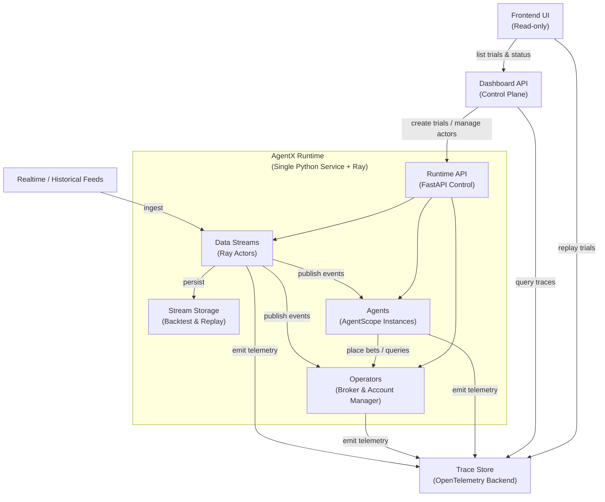

# AgentX (Proof-of-Concept)

AgentX is a system for hosting AI agents that run continously on realtime data
to reason about future outcomes and act on them, such as trading and placing bets.

*"AgentX" is a code name for this project, and the public name will be decided in the future.*

## Design Goal

Show a proof-of-concept of a system capable of hosting multiple agents and producing realtime
data streams running on a single machine. Specifically, the system should:

- operate an environment that provides realtime data and manages states such as trades and bets placed, and virtual dollar balance.
- host AI agents written in AgentScope framework (Python)
- leverage Open Telemetry traces for activity monitoring and collections
- come with UI that supports viewing of realtime activities and historical replay

Non-goals:

- Distributed system: prioritize functionality first using a minimal implementation.
- Propietary or private data: the project will be open-source
- Excessive algorithmic optimization: prioritize system-building over optimization for proof-of-concept.

## Architecture

There are 6 main components:
- **Data Streams**: data sources
- **Operators**: environment state managers
- **Agents**: autonomous actors
- **Trace Store**: activity data collection
- **Dashboard**: control plane
- **Frontend**: visualization

Data Streams, Operators and Agents follow the actor model:
each instance runs as a background task and maintains its own state.
We use [Ray](https://docs.ray.io/en/latest/ray-core/actors.html#actor-guide)
to implement these actors.

All components are hosted on a single Python service that
exposes a REST API for Dashboard and Frontend.

### **Data Streams** and **Operators**

Data Streams and Operators together form the *environments* for agents.

Data Streams are actors that publishes data as soon as it is available.
- Each Data Stream has a list of consumers to publish to.
- Data processing on the consumer side may happen asynchronously depending on implementation.
- All data is stored; and a Data Stream can also be created
from historical data with configurable publishing frequency for backtesting.

Operators are actors that manage the state affected by agents' actions. 
For examples, an Operator may:
- act as the broker for all the trades or bets placed by agents
- keep track of each agent's account balance
- support querying of these state by agents (e.g., tools for looking up account balance)

Each Operator may also consume Data Streams to build its own database of historical data
to support querying from agents. 

In short, Data Streams enable asynchronous delivery of data to agents,
while Operators support synchronous actions by the agents.

### **Agents**

Agents are autonomous actors that consume realtime data from Data Streams
and perform sequences of actions 
(e.g., trades, bets and queries.) in response.

Agents can have different implementations. It may choose to maintain its own 
state of past observations and actions and summarize learnings from them.
It may also choose to buffer and defer data processing until a specific time
or amount of data has been collected.

Agents are implemented using the [AgentScope](https://doc.agentscope.io/)
Python framework. We may need to wrap the underlying AgentScope agent
to manage buffering and concurrent processing.

### **Trace Store**

Trace Store captures all activity traces emitted by the Data Streams, Operators
and Agents. It is also capable of retreving historical traces for a replay that
has no side effect.

### **Dashboard**

Dashboard is the central control plane for all actors (Data Streams, Operators and Agents).
- It creates environments of Data Streams and Operators with historical or realtime data.
- It creates agents to run on environments.
- It supports querying of actor status as well as shuting down actors.

A combination of an environment, a set of agent instances and a schedule to
start and shutdown the actors is a *trial*.
A trial can also run with only Data Streams for raw data collection.

For the POC, the dashboard only exposes a REST API, and a trial can be created
via a YAML configuration file.

### **Frontend**

For POC, Frontend is read-only. It uses data from the Dashboard to display
trials, and renders activities from Trace Store.
It can replays historical trials from traces without actually running them.