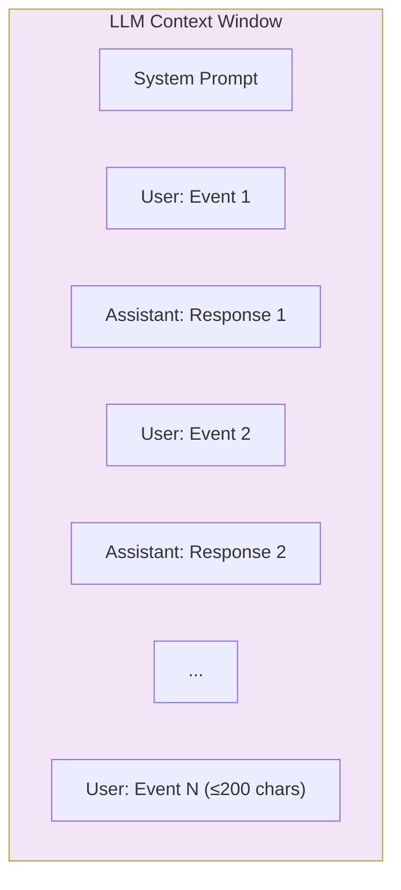
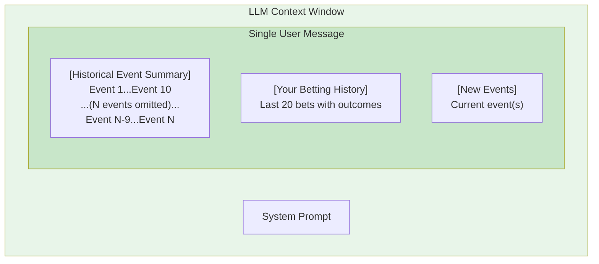

# BettingAgent Context Management

What actually goes into the LLM model context window.

## Normal Operation (< 20 messages)

Events accumulate in memory as user/assistant message pairs until threshold is reached.

---

## After Compression (≥ 20 messages)

Memory is cleared. Compressed summary + new events sent as single user message.

---

## Compression Thresholds

| What | Limit |
|------|-------|
| Messages before compression | 20 |
| Events in sparse summary | First 10 + Last 10 |
| Max chars per event | 200 |
| Bet history included | Last 20 bets |
